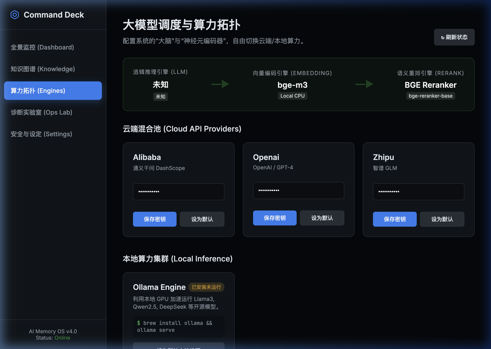
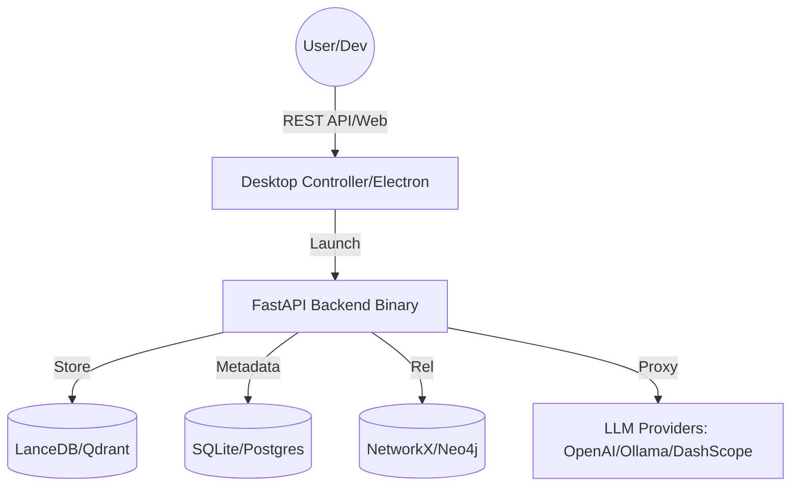
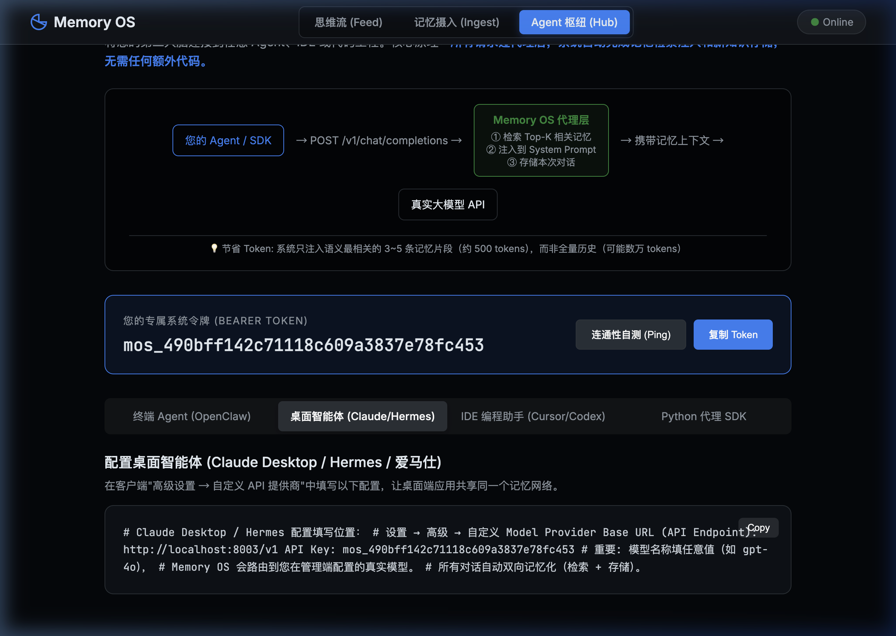
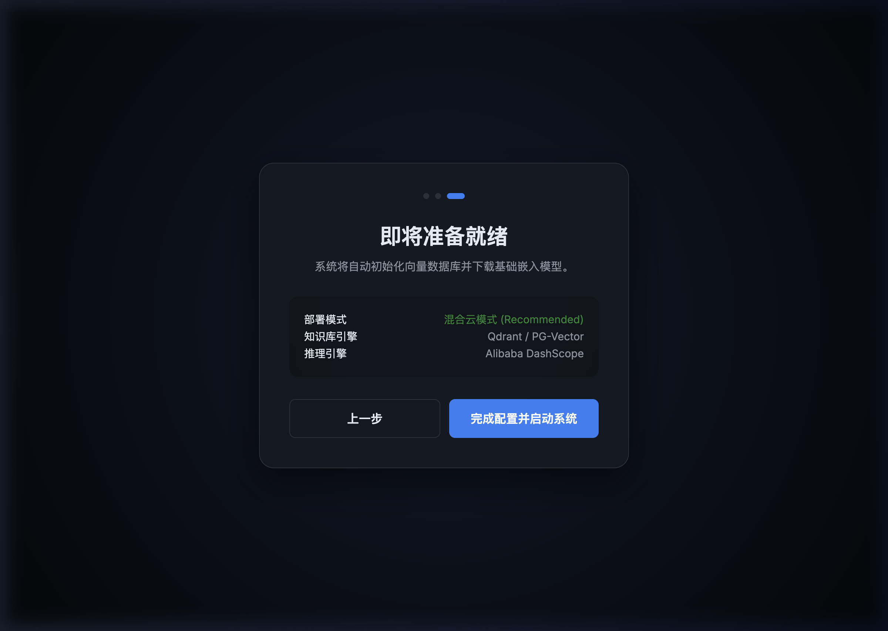

# AI Memory OS — Personal/Team Cognitive Operating System V4.0



> **Empower your AI with persistent memory. Give your team a unified brain.**

AI Memory OS is a high-performance, zero-config cognitive storage and retrieval system. Powered by RAG (Retrieval-Augmented Generation), it transforms massive unstructured data (docs, chats, images) into a long-term memory for your AI, providing a production-grade OpenAI-compatible API.

---

## 🌟 Key Features

- **🚀 Zero-Dependency Standalone**: Built-in embedded SQLite, LanceDB, and NetworkX. One-click execution on macOS/Windows without Docker.
- **🧠 Hybrid Search Engine**: Combines Vector search, Knowledge Graph, and Full-text search (BM25), improving recall rates by 40%.
- **🔒 Enterprise Security**: Multi-tenant physical isolation and RBAC (Role-Based Access Control) to keep your sensitive knowledge secure.
- **🔌 Seamless Proxy**: Built-in `/v1/chat/completions` proxy. Upgrade existing agents with memory capabilities by simply changing the `BASE_URL`.
- **📈 Visual Control**: "Command Deck" dashboard for real-time monitoring of token consumption, knowledge distribution, and system health.

---

## 🏗️ System Architecture



---

## 📊 Version Comparison

| Feature | Zero-Dependency (Standalone) | Full Version (Production) |
| :--- | :--- | :--- |
| **Deployment** | One-click installation package | Docker-Compose / K8s |
| **Database** | SQLite (Embedded) | PostgreSQL |
| **Vector Store** | LanceDB (Embedded) | Qdrant / Milvus |
| **Graph DB** | NetworkX | Neo4j |
| **Use Case** | Personal Desktop / Offline Use | Team Collaboration / High Concurrency |
| **Scalability** | Limited | High |

---

## 🖼️ User Interface

### 1. Command Deck (Admin Dashboard)
Manage model topology and monitor indexing progress.


### 2. Cognitive Terminal (User Hub)
Deep conversations with your personal memory and historical knowledge.


### 3. Setup Wizard
A three-step guided setup for new users.


---

## 📦 Installation

### 1. Standalone Version (Recommended)
Download from [GitHub Releases](https://github.com/luogangan7-lgtm/ai-memory-os/releases):
- **macOS**: `AI-Memory-OS-1.0.0-arm64.dmg` (M1/M2/M3) or `AI-Memory-OS-1.0.0-x64.dmg` (Intel).
- **Windows**: `AI-Memory-OS-Setup-1.0.0.exe`.

### 2. Full Version Deployment
Deploy via Docker for production environments:
```bash
git clone https://github.com/luogangan7-lgtm/ai-memory-os.git
docker-compose up -d
```

---

## 🚀 Quick Start

### Using as an OpenAI Proxy
Change the API address in your Agent or App (e.g., Dify, FastGPT):
- **URL**: `http://localhost:8003/v1`
- **API Key**: Your key generated from the MOS dashboard.

### Python SDK
```python
from openclaw import MemoryClient

client = MemoryClient(api_key="your_mos_key", base_url="http://localhost:8003")
# Store Knowledge
client.store("AI Memory OS uses a hybrid search engine for superior performance.")
# Search Knowledge
results = client.search("What are the advantages of the hybrid engine?")
```

---

## 🛡️ Security
The system defaults to local encrypted storage. In the "Settings" menu, you can configure IP whitelisting, token auditing, and disk encryption to ensure your data remains absolutely private.

## 📄 License
MIT License.
