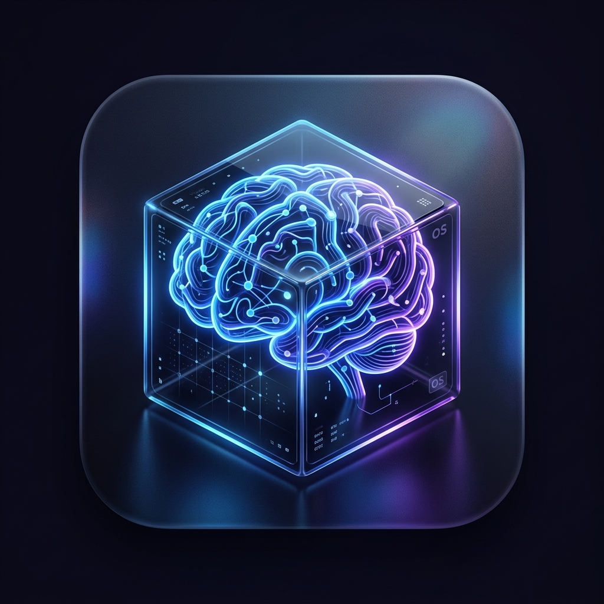

# AI Memory OS — 个人/团队认知操作系统 V4.0



> **让你的 AI 拥有持久记忆，让你的团队拥有统一大脑。**

AI Memory OS 是一款高性能、零配置的认知存储与检索系统。它通过 RAG（检索增强生成）技术，将海量非结构化数据（文档、对话、图片）转化为 AI 的长效记忆，并提供生产级的 OpenAI 兼容接口。

## 🌟 核心特性

- **🚀 零依赖双击即用**：内置嵌入式 SQLite、LanceDB 和 NetworkX，无需 Docker 即可在 macOS/Windows/Linux 运行。
- **🧠 混合检索引擎**：结合向量检索 (Vector)、图谱检索 (Knowledge Graph) 与全文检索 (BM25)，召回率提升 40%。
- **🔒 企业级安全隔离**：多租户物理隔离，支持 RBAC 权限管控，保护敏感知识不外泄。
- **🔌 零侵入代理**：内置 `/v1/chat/completions` 代理，现有 Agent 只需更改 `BASE_URL` 即可获得记忆增强。
- **📈 算力仪表盘**：实时监控 Token 消耗、存储量级及系统健康状态。

## 📦 下载安装

1. **前往 [Releases](https://github.com/luolimo/ai-memory-os/releases) 下载对应平台的安装包。**
2. **macOS**: 双击 `.dmg` 拖入 Applications，首次打开需在“系统设置 -> 隐私与安全”中点击“仍要打开”。
3. **Windows**: 运行 `.exe` 安装程序。
4. **Linux**: 给 `.AppImage` 执行权限并运行。

## 🛠 开发架构

- **Backend**: Python 3.14 + FastAPI + PyInstaller
- **Frontend**: Vanilla JS + CSS (Admin Dashboard & User Hub)
- **Database**:
  - Standalone: SQLite + LanceDB + NetworkX
  - Production: PostgreSQL + Qdrant + Neo4j (Optional)
- **Desktop**: Electron + Tauri-like Tray Controller

## 🚀 快速开始 (SDK)

```python
from openclaw import MemoryClient

client = MemoryClient(api_key="your_mos_key", base_url="http://localhost:8003")
client.store("今天学习了如何使用 PyInstaller 打包 FastAPI 项目。")
```

## 📄 开源协议

MIT License.
