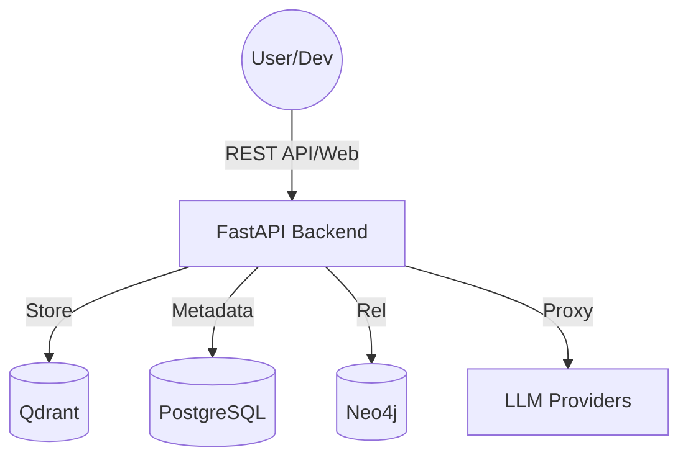

# AI Memory OS — Cognitive Storage & Retrieval System V6.1 (Production-Ready)


> **Give your AI persistent memory, and your team a unified brain.**

AI Memory OS is a high-performance, zero-config cognitive storage system. Using RAG (Retrieval-Augmented Generation) technology, it transforms massive amounts of unstructured data into long-term memory for AI, offering a production-ready OpenAI-compatible API.

---

## 🌟 Core Features (New in V6.1)

- **🚀 21 Top-Tier Model Providers**: Full support for DeepSeek, SiliconFlow, Jina AI, Moonshot, ElevenLabs (Audio), Tencent CI (Vision), and more, properly configured with localized pricing ($ and ¥).
- **🔮 Intelligent Pipeline Config**: Completely overhauled Model Configuration UX. Strict capability filters ensure only embedding models appear in the Embedding pipeline and rerank models in the Rerank pipeline. Includes smart sorting putting high-value Recommended (★) models first.
- **🔌 MCP Memory Gateway**: Provide long-term memory to any AI Agent, supporting 1-click integration for 7 Agents (Cursor, Claude Desktop, etc.).
- **🧠 Hybrid Search Engine**: Combines Vector search, Knowledge Graph search, and Full-text BM25 search.
- **🎨 Neural Void UI**: Stunning cyber-aesthetic dark theme with seamless login overlay and particle backgrounds.

---

## 🏗️ System Architecture



---

## 📦 Download & Installation Guide

### Option 1: Quick Start (Docker, Recommended)
Use Docker Compose to launch the entire production environment in one click (Database, Vector store, Graph store, and Backend).
```bash
# 1. Clone the repository
git clone https://github.com/luogangan7-lgtm/ai-memory-os.git
cd ai-memory-os

# 2. Launch production environment
docker compose up -d

# 3. Access the system
# Command Deck (Admin): http://localhost:8003/manage
# User Terminal: http://localhost:8003/app
```

### Option 2: Developer Setup (Running from source)
If you want to control the database yourself or do custom development, please follow these steps to download the packages and set up the environment:

#### 1. Backend Dependencies (Python 3.10+)
```bash
git clone https://github.com/luogangan7-lgtm/ai-memory-os.git
cd ai-memory-os

# Create virtual environment and install Python packages
python3 -m venv .venv
source .venv/bin/activate
pip install -r backend/requirements.txt

# Run the server (Ensure PostgreSQL and Qdrant are running locally)
python3 run.py
```

#### 2. Frontend Build (Node.js 18+)
The system comes with pre-compiled static files so compilation is optional. To modify the React interface, download the npm packages:
```bash
cd webui
npm install
npm run build
# After building, the output will automatically be available to the backend
```

#### 3. MCP Agent Bridge Setup
If you use Cursor or Claude Desktop to connect to the memory pool:
```bash
cd webui/packages/mcp-bridge
npm install
```

---

## 🚀 Quick Start

### Use as an OpenAI Proxy
Modify your Agent or application (e.g. Dify, FastGPT) API URL to:
- **URL**: `http://localhost:8003/v1`
- **API Key**: The key generated in your MOS Admin Console

### Connect to Claude Desktop
1. Open the User App `http://localhost:8003/app`
2. Click on 🔑 **Connection Config**, and select Claude Desktop.
3. Copy the generated JSON config and paste it into your `claude_desktop_config.json` file, then restart Claude.

---

## 🛡️ Security
Local encrypted storage is enabled by default. You can configure IP whitelists, Token auditing, and physical disk encryption via the "Security & Settings" panel to keep your personal brain data strictly private.

## 📄 License
MIT License.
