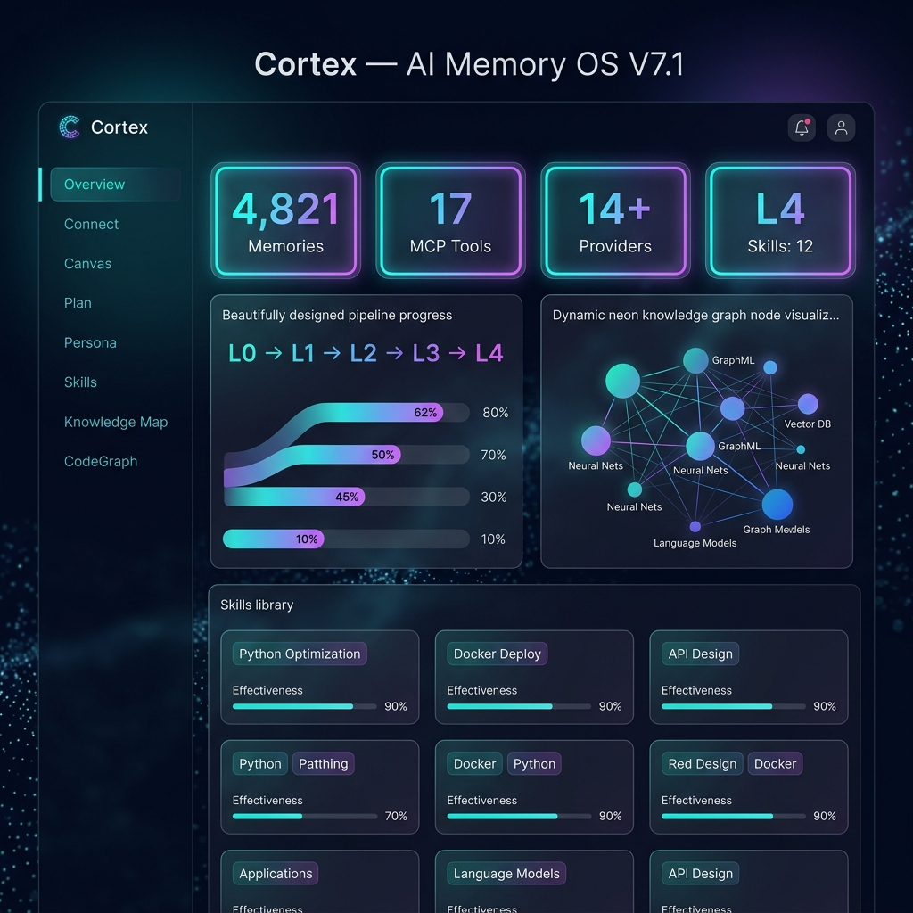
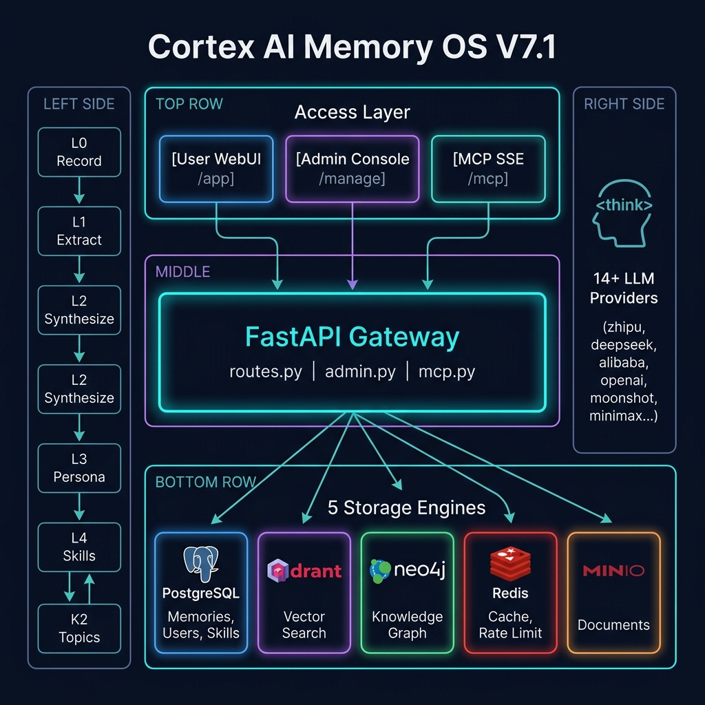

# Cortex — AI Agent 长期记忆操作系统 V7.1

<div align="center">

[](https://opensource.org/licenses/MIT)
[](#)
[](#)
[](#)
[](#)

**赋予你的 AI 智能体永久长期记忆，为你的团队构建统一的知识大脑。**

[English README](README.md) | [功能特性](#-核心能力) | [架构图](#-系统架构) | [快速部署](#-快速开始) | [MCP接入](#-mcp接入)

</div>

---

<div align="center">



</div>

---

## 🚀 V7.1 新特性

| 功能 | 说明 |
|---------|-------------|
| **K2 三阶段知识管道** | 实时话题分类 → 超大话题自动拆分（阈值20条）→ 语义合并 |
| **LLM 质量门控** | 内化前用用户自己的 LLM 评分（0–1），低于 0.5 跳过 |
| **推理标签集中剥离** | `<think>` 标签自动剥离，兼容 MiniMax-M2.7 / DeepSeek-R1 / Qwen |
| **429 指数退避重试** | 限流时自动重试，1s→2s→4s（最多3次），生产级稳定性 |
| **L4 技能进化** | 合并相似技能，PRM 反馈闭环更新 effectiveness 评分 |
| **代码图谱 REST 视图** | `/api/code-entities` 三视图（文件/实体/语言）替代 MCP 文本搜索 |
| **中文分块修复** | CJK 字符数计词（原：词数，导致中文文档只生成1块的 Bug 已修复） |
| **内联健康检测** | 页面 title 实时显示 `✅ ALL OK` / `⚠️ N DOWN` / `❌ API DOWN` |

---

## 🌟 核心能力

### 1. 🔌 MCP 记忆网关（18个工具）
完整兼容 Anthropic MCP 规范，支持 Cursor / Claude Desktop / Cline / Roo Code / Codex CLI。

| 类别 | 工具 |
|------|------|
| 记忆 CRUD（9个） | `memory_search`、`memory_store`、`memory_list`、`memory_delete`、`memory_reflect`、`memory_get_persona`、`memory_task_canvas_get`、`memory_task_canvas_update`、`memory_status` |
| 代码图谱（5个） | `code_index`、`code_search`、`code_relations`、`code_impact`、`code_memory_link` |
| 技能与反馈（2个） | `memory_feedback`、`memory_skill_list` |
| 文档与公共池（2个） | `doc_search`、`public_browse` |

### 2. 🧠 五层认知管线（L0 → L4）
```
L0 记录   → 原始记忆存储 + 向量化
L1 提取   → LLM 提取事实/决策/偏好
L2 聚合   → 相似事实聚合为场景
L3 画像   → 生成用户画像 + 知识图谱
L4 技能   → 重复行为结晶为可复用技能
K2 话题   → 公共知识池分类/拆分/合并
```

### 3. 🤖 14+ 厂商 LLM 支持
智谱 · MiniMax · DeepSeek · 阿里云百炼 · OpenAI · Anthropic · Moonshot · 字节豆包 · 百度文心 · 腾讯混元 · 讯飞星火 · 阶跃星辰 · 零一万物 · SiliconFlow + 兼容 OpenAI 的通用接入

所有厂商统一处理推理标签，响应自动清洗。

### 4. 📄 文档双层处理
- **T1（系统成本）**：文本提取 → 语义分块 → 向量化 → 立即可检索
- **T2（用户 LLM）**：深度摘要 + 实体抽取 + 知识图谱关联

---

## 🏗️ 系统架构

<div align="center">



</div>

---

## 📦 快速开始

### 方式 A：Docker Compose（推荐）

```bash
# 1. 克隆项目
git clone https://github.com/luogangan7-lgtm/ai-memory-os.git
cd ai-memory-os

# 2. 配置环境变量（生产环境必须修改密码！）
cp .env.example .env
# 编辑 .env：设置 POSTGRES_PASSWORD / NEO4J_PASSWORD / MEMORY_OS_MASTER_KEY

# 3. 启动
docker compose up -d

# 4. 验证
curl http://localhost:8003/admin/health

# 访问：
# 用户端：http://localhost:8003/app
# 管理端：http://localhost:8003/manage（默认账号: admin / admin）
```

### 方式 B：单机模式（无需 Docker）

```bash
python3 -m venv .venv && source .venv/bin/activate
pip install -r backend/requirements.txt
USE_STANDALONE=true python3 run.py
```

---

## 🔌 MCP接入

### SSE 连接
```
GET https://你的域名/mcp?token=mos_你的token
```

### Cursor / Cline / Codex CLI
```json
{
  "mcpServers": {
    "cortex-memory": {
      "command": "npx",
      "args": ["-y", "ai-memory-os-mcp", "--token=mos_你的token", "--server=https://你的域名"]
    }
  }
}
```

---

## 🛡️ 安全

- **多租户隔离**：`team_id` 全链路隔离，不同用户数据完全分离
- **Key 加密存储**：用户 LLM 密钥 AES-256-GCM 加密落盘（`MEMORY_OS_MASTER_KEY`）
- **JWT 认证**：24小时 access token，HMAC 签名
- **PII 过滤**：内化前自动检测并拦截 API Key / 邮箱 / 手机号 / 身份证
- **速率限制**：Redis 限流，防滥用

### ⚠️ 生产部署前必改

```bash
MEMORY_OS_MASTER_KEY=<base64编码的32字节随机密钥>
MEMORY_OS_JWT_SECRET=<64位随机十六进制>
POSTGRES_PASSWORD=<强密码，非默认值>
NEO4J_PASSWORD=<强密码，非默认值>
```

---

## 📄 开源协议

基于 [MIT License](LICENSE) 开源。

---

<div align="center">

**Cortex V7.1** | Python 3.11 + FastAPI + React + Qdrant + Neo4j + PostgreSQL

*让你的 AI 智能体真正记住重要的事情。*

</div>
