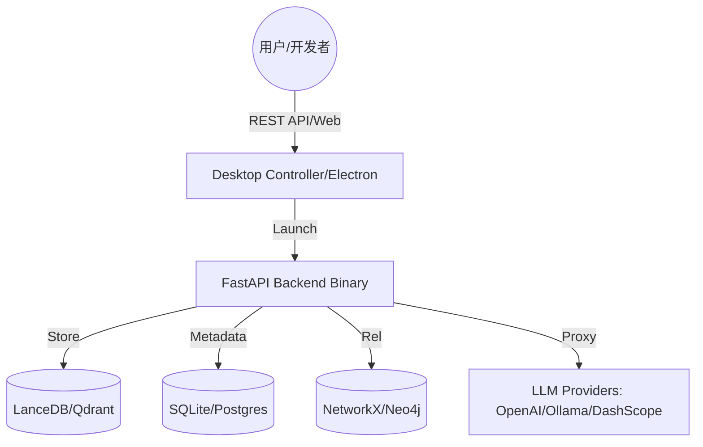

# AI Memory OS — 个人/团队认知操作系统 V6.0


> **让你的 AI 拥有持久记忆，让你的团队拥有统一大脑。**

AI Memory OS 是一款高性能、零配置的认知存储与检索系统。它通过 RAG（检索增强生成）技术，将海量非结构化数据（文档、对话、图片）转化为 AI 的长效记忆，并提供生产级的 OpenAI 兼容接口。

---

## 🌟 核心特性

- **🚀 MCP 记忆网关 — 为任意 AI Agent 提供长期记忆**: 支持 21 家模型厂商，100+ 模型自动推荐，5 个 MCP 工具，7 种 Agent 一键接入
- **🔌 智能环境检测**: 桌面端自动检测 Docker 环境，缺失时提供一键下载引导，无缝切换 Standalone/Production 模式。
- **🧠 混合检索引擎**: 结合向量检索 (Vector)、图谱检索 (Knowledge Graph) 与全文检索 (BM25)，召回率提升 40%。
- **🔒 企业级安全隔离**: 多租户物理隔离，支持 RBAC 权限管控，保护敏感知识不外泄。
- **🔌 零侵入代理**: 内置 `/v1/chat/completions` 代理，现有 Agent 只需更改 `BASE_URL` 即可获得记忆增强。
- **📈 可视化管理**: 提供“神经中枢控制台”，实时监控算力消耗、知识分布及系统健康状态。

---

## 🏗️ 系统架构



---

## 📊 版本对比

| 特性 | 零依赖版本 (Standalone) | 完整版 (Production) |
| :--- | :--- | :--- |
| **部署方式** | 双击安装包即用 | Docker-Compose / K8s |
| **数据库** | SQLite (内嵌) | PostgreSQL |
| **向量库** | LanceDB (内嵌) | Qdrant / Milvus |
| **知识图谱** | NetworkX | Neo4j |
| **适用场景** | 个人桌面、本地离线使用 | 团队共享、高并发生产环境 |
| **扩展性** | 受限 | 极高 |

---

## 🖼️ 系统界面

### 1. 神经中枢指控台 (Admin Dashboard)
管理模型算力拓扑、监控知识库索引进度。


### 2. 个人认知终端 (User Hub)
与你的个人记忆进行深度对话，检索历史知识。


### 3. 首次运行配置向导 (Setup Wizard)
引导用户完成基础配置，三步开启认知操作系统。


---

## 📦 下载安装

### 1. 零依赖版本 (推荐)
前往 [GitHub Releases](https://github.com/luogangan7-lgtm/ai-memory-os/releases) 下载：
- **macOS**: `AI-Memory-OS-1.0.0-arm64.dmg` (M1/M2/M3) 或 `AI-Memory-OS-1.0.0-x64.dmg` (Intel)。
- **Windows**: `AI-Memory-OS-Setup-1.0.0.exe`。

### 2. 完整版部署 (推荐生产环境)
使用 Docker 一键启动包含数据库、向量库及后端的全量生产环境：
```bash
git clone https://github.com/luogangan7-lgtm/ai-memory-os.git
docker-compose up -d
```
启动后，访问 `http://localhost:8003/manage` 即可进入指控台。

---

## 🚀 快速开始

### 作为 OpenAI 代理使用
将你的 Agent 或应用（如 Dify, FastGPT）的 API 地址修改为：
- **URL**: `http://localhost:8003/v1`
- **API Key**: 你的 MOS 控制台生成的密钥

### 使用 Python SDK
```python
from openclaw import MemoryClient

client = MemoryClient(api_key="your_mos_key", base_url="http://localhost:8003")
# 存储知识
client.store("AI Memory OS 采用混合检索引擎，性能卓越。")
# 检索知识
results = client.search("混合引擎的优势是什么？")
```

---

## 🛡️ 安全说明
系统默认开启本地加密存储。在“安全与设定”中，您可以配置 IP 白名单、Token 审计以及物理盘加密，确保您的个人大脑数据绝对私有。

## 📄 开源协议
MIT License.

## 🆕 V6.0 更新内容 (2026-05)

### 🤖 MCP 接入架构
- **5 个 MCP 工具**: `memory_search` / `memory_store` / `memory_list` / `memory_delete` / `memory_status`
- **7 种 Agent 一键接入**: Cursor / Claude Desktop / OpenClaw / Cline / Continue / Roo Code / Codex CLI
- **双轨传输**: stdio + SSE 同时支持
- **系统提示词模板**: 完整版 / 精简版 / 开发版

### 🎨 全新 WebUI
- **Neural Void 设计系统**: Deep Space 深色主题 + 3D 粒子背景
- **React + TypeScript + Vite**: 26 源文件，1,475 行，TS/ESLint 双零
- **模型配置中心**: 21 家厂商，100+ 模型，自动推荐 + 本地检测 + 实时连通测试
- **知识图谱可视化**: Canvas 2D 节点网络
- **响应式设计**: 桌面/平板/手机三档适配

### 📦 快速开始
```bash
# 克隆项目
git clone https://github.com/luogangan7-lgtm/ai-memory-os.git
cd ai-memory-os

# 单机模式（无需 Docker）
python3 run.py
# 访问: http://localhost:8003/manage/

# 用户端
# 访问: http://localhost:8003/manage/#/app
# 获取 MCP Token + Agent 配置指南

# MCP Bridge 安装
cd webui/packages/mcp-bridge
npm install
node bin/cli.js --token=YOUR_TOKEN --server=http://localhost:8003
```

### 🔗 用户接入
1. 打开用户端 `http://localhost:8003/manage/#/app`
2. 点击 🔑 接入配置
3. 选择你的 Agent
4. 复制配置 JSON 和系统提示词
5. 粘贴到 Agent 的 MCP 配置中
6. 重启 Agent 即可使用

