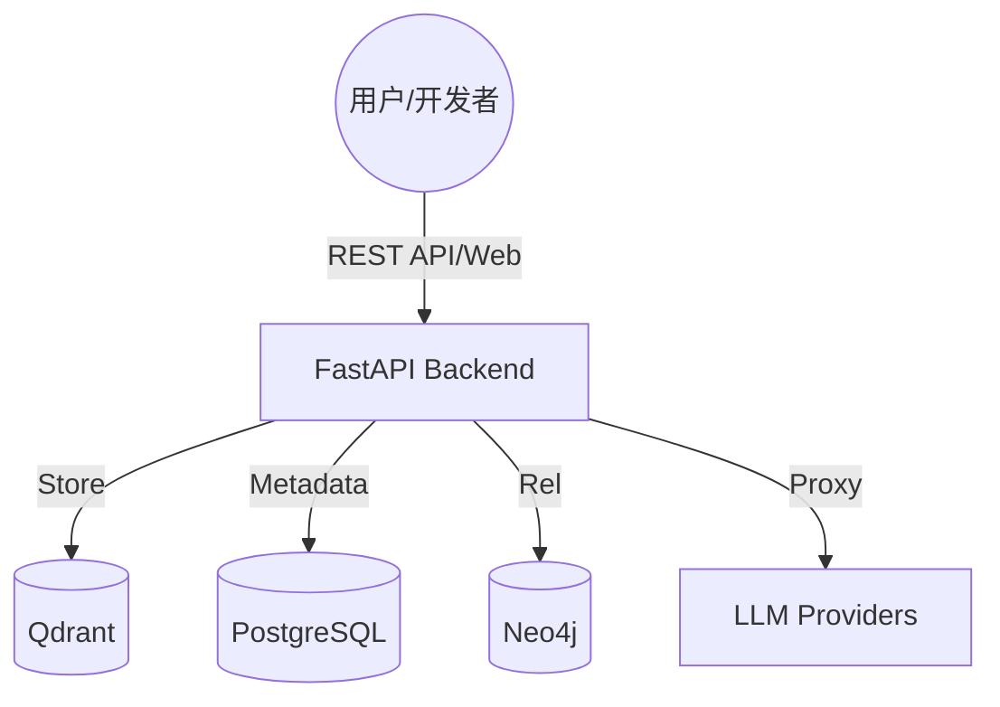

# AI Memory OS — 个人/团队认知操作系统 V6.1 (Production-Ready)


> **让你的 AI 拥有持久记忆，让你的团队拥有统一大脑。**

AI Memory OS 是一款高性能、零配置的认知存储与检索系统。它通过 RAG（检索增强生成）技术，将海量非结构化数据转化为 AI 的长效记忆，并提供生产级的 OpenAI 兼容接口。

---

## 🌟 核心特性 (V6.1 新增)

- **🚀 21大顶尖模型全系支持**: 全面支持 DeepSeek、硅基流动 (SiliconFlow)、Jina AI、月之暗面 (Moonshot)、ElevenLabs (语音)、腾讯云数据万象 (视觉) 等国内外大模型，完美适配国内人民币 (¥) 与海外美金 ($) 计费体系。
- **🔮 智能管线配置**: 彻底重构模型配置中心 UX。在“向量化”与“重排序”管线中加入严格的能力拦截器，告别盲选，搭配星号 (★) 置顶的性价比推荐算法。
- **🔌 MCP 记忆网关**: 为任意 AI Agent 提供长期记忆，支持 7 种 Agent (Cursor, Claude Desktop 等) 一键接入。
- **🧠 混合检索引擎**: 结合向量检索 (Vector)、图谱检索 (Knowledge Graph) 与全文检索 (BM25)。
- **🎨 Neural Void 赛博交互**: 引入“神经虚空”风格的登录舱与免密动态交互前端。

---

## 🏗️ 系统架构



---

## 📦 下载与安装指南

### 方式一：快速启动 (基于 Docker，推荐小白用户)
使用 Docker 可以一键启动包含数据库、向量库、图数据库及后端的全量生产环境。
```bash
# 1. 克隆项目仓库
git clone https://github.com/luogangan7-lgtm/ai-memory-os.git
cd ai-memory-os

# 2. 启动生产环境
docker compose up -d

# 3. 访问系统
# 指控中心: http://localhost:8003/manage
# 用户终端: http://localhost:8003/app
```

### 方式二：开发者手动部署 (源码运行)
如果您希望自己控制数据库，或者进行二次开发，请按如下步骤下载包并安装环境：

#### 1. 后端依赖安装 (Python 3.10+)
```bash
git clone https://github.com/luogangan7-lgtm/ai-memory-os.git
cd ai-memory-os

# 创建虚拟环境并下载 Python 依赖包
python3 -m venv .venv
source .venv/bin/activate
pip install -r backend/requirements.txt

# 运行服务 (请确保您的机器上已有 PostgreSQL 和 Qdrant)
python3 run.py
```

#### 2. 前端界面编译 (Node.js 18+)
系统自带已编译的静态文件，无需强制编译。如需自行修改 React 界面，请下载 npm 包：
```bash
cd webui
npm install
npm run build
# 编译完成后，将 dist 产物移入根目录的 webui-dist 文件夹供后端托管
```

#### 3. MCP Agent 桥接端安装
如果您使用 Cursor 或 Claude Desktop 接入记忆体：
```bash
cd webui/packages/mcp-bridge
npm install
```

---

## 🚀 快速开始

### 作为 OpenAI 代理使用
将你的 Agent 或应用（如 Dify, FastGPT）的 API 地址修改为：
- **URL**: `http://localhost:8003/v1`
- **API Key**: 你的 MOS 控制台生成的密钥

### 接入 Claude Desktop
1. 打开用户端 `http://localhost:8003/app`
2. 点击 🔑 **接入配置**，选择 Claude Desktop。
3. 复制生成的 JSON 配置，将其粘贴进您的 `claude_desktop_config.json` 文件中并重启应用即可。

---

## 🛡️ 安全说明
系统默认开启本地加密存储。在“安全与设定”中，您可以配置 IP 白名单、Token 审计以及物理盘加密，确保您的个人大脑数据绝对私有。

## 📄 开源协议
MIT License.
